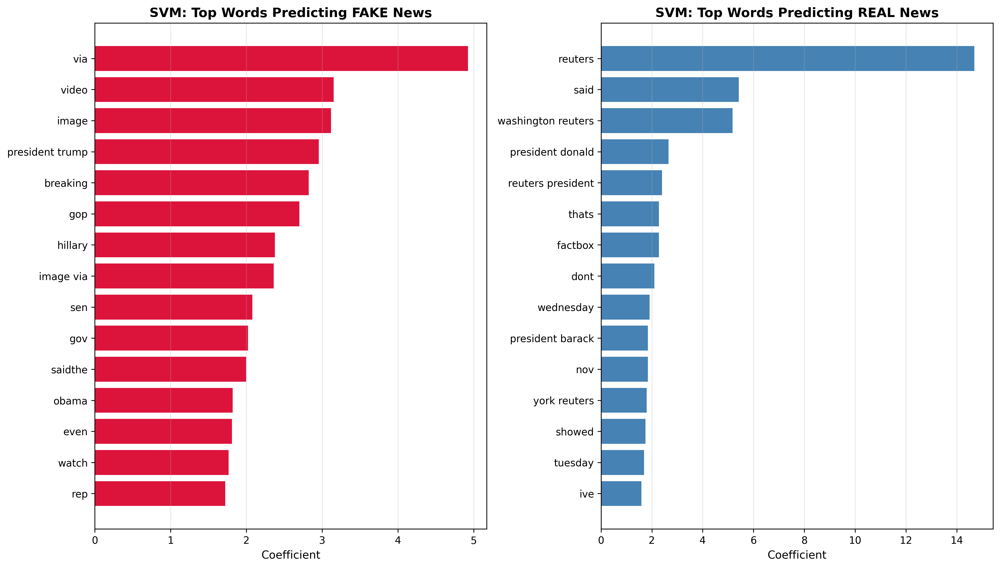

# Fake News Detection:  Experimental Comparison of Machine Learning(ML) and Deep Learning(DL) Approaches
An experimental comparison of ML(Decision Trees, Support Vector Machines) and DL(Long Short-Term Memory, Convolutional Neural Network) approaches for fake news detection, with analysis of dataset shortcuts and cross-domain generalization failure.

## Key Findings

XAI analysis (feature importance, coefficient analysis, LIME) was conducted to investigate the performance collapse. It was discovered that the "reuters" token dominated predictions across all ML models. In one case, a FAKE article was misclassified as REAL simply because it contained "reuters."

The models learned source-specific shortcuts because almost all "real" articles in the dataset come from Reuters.
