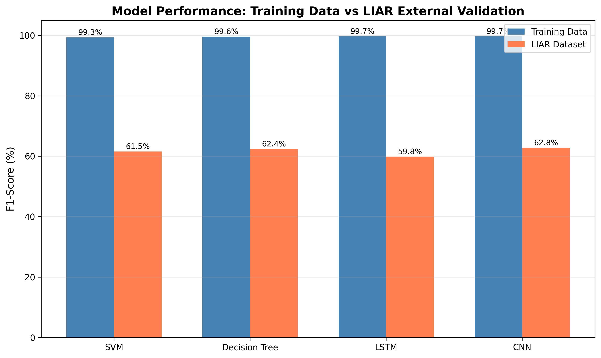

# Fake News Detection:  Experimental Comparison of Machine Learning(ML) and Deep Learning(DL) Approaches
An experimental comparison of ML(Decision Trees, Support Vector Machines) and DL(Long Short-Term Memory, Convolutional Neural Network) approaches for fake news detection, with analysis of dataset shortcuts and cross-domain generalization failure.

## Key Findings
All models achieved ~99% F1-scores on internal testing. However, when evaluated on the external dataset, all models collapsed to 60-62% F1-score regardless of model complexity, showing that a high in-distribution accuracy does not guarantee real-world generalization.




XAI analysis (feature importance, coefficient analysis, LIME) was conducted to investigate the performance collapse. It was discovered that the "reuters" token dominated predictions across all ML models. In one case, a FAKE article was misclassified as REAL simply because it contained "reuters."


Explanability analysis (feature importance, coefficient analysis, LIME) was conducted to investigate the performance collapse. It revealed that the "reuters" token dominated predictions across all ML models. In one case, a FAKE article was misclassified as REAL simply because it contained "reuters."
The models learned source-specific shortcuts because almost all "real" articles in the dataset come from Reuters. Instead of learning semantic patterns of misinformation, the models memorized that "reuters" = REAL news using it as a shortcut that fails on any dataset without this source indicator.

## ML and DL models compared:

- **Traditional ML**: SVM, Decision Tree
- **Deep Learning**: LSTM, CNN

DL models required **10,000x more training time**, but showed no generalization benefits compared over  ML approaches when tested on external validation.

## Dataset Used

This project uses the [ISOT Dataset](https://www.kaggle.com/clmentbisaillon/fake-and-real-news-dataset) from Kaggle.

**Download steps:**
1. Click the link above
2. Download the dataset as a zip
3. Extract the zip file, You will get an 'archive' folder containing `Fake.csv` and `True.csv`


## Preprocessing steps:

**ISOT Dataset:** The Fake.csv and True.csv files were merged into a single dataset. During cleaning, 631 empty rows were found and removed, along with 5,609 duplicate articles. The text was then preprocessed by converting to lowercase, removing URLs and emails, filtering out stopwords, and applying lemmatization. After all cleaning steps, the final dataset contained 38,658 articles — 21,196 labeled as Real and 17,462 labeled as Fake. This dataset was used for training, validation, and testing.

**LIAR Dataset:** The original dataset had 6 classes, which were converted to binary labels — true, mostly-true, and half-true became Real, while false, pants-fire, and barely-true became Fake. I applied the same text cleaning pipeline used for ISOT. The final dataset contained 2,551 statements.

The significant difference in text length between datasets also contributes to the performance collapse.


## Installation
```bash
# Clone the repository
git clone https://github.com/yourusername/fake-news-detection.git
cd fake-news-detection

# Create virtual environment (optional but recommended)
python -m venv venv
source venv/bin/activate  # On Windows: venv\Scripts\activate

# Install dependencies
pip install -r requirements.txt
```

## How to Run
**Note:** This notebook was originally developed in Google Colab.
```

Option 1: Google Colab
1. Upload the `archive` folder to your Google Drive
2. Open the notebook in Colab
3. Update paths to `/content/drive/MyDrive/archive/`
4. Mount Drive and run all cells

Option 2: Run Locally
1. Download the dataset (see above)
2. Place the `archive` folder in the project root:

fake-news-detection/
├── archive/          ← (download from Kaggle)
│   ├── Fake.csv
│   └── True.csv
├── fakenewsdetection.ipynb
└── README.md
```
3. Install dependencies:
```bash
pip install -r requirements.txt
```
4. Update paths to `archive/Fake.csv` and `archive/True.csv`
5. Run the notebook

